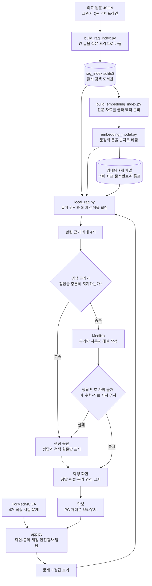

# 실행 코드 전체 흐름도

## 중학생을 위한 한 장짜리 코드 지도

다섯 실행 파일은 서로 경쟁하는 프로그램이 아니라, **자료 만들기 팀**과 **문제 풀이 팀**으로 역할을 나눕니다.

- 자료 만들기 팀: `build_rag_index.py` → `build_embedding_index.py` → `embedding_model.py`
- 문제 풀이 팀: `app.py` → `local_rag.py` → `embedding_model.py`

