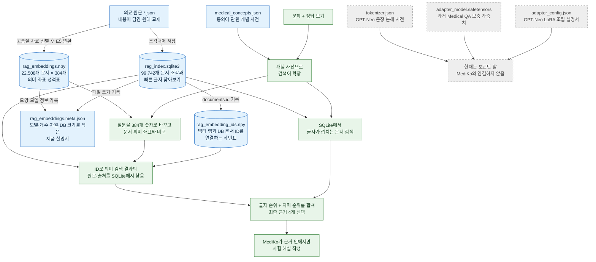

# 데이터·인덱스·모델 파일 전체 흐름도

## 중학생을 위한 한 장짜리 파일 지도

핵심은 `rag_embeddings.npy`만으로는 원문을 읽을 수 없다는 점입니다. `rag_embedding_ids.npy`가 학번을 알려 주고, `rag_index.sqlite3`가 실제 문장과 출처를 돌려줍니다. `rag_embeddings.meta.json`은 이 세 파일이 같은 세트인지 검사합니다.
