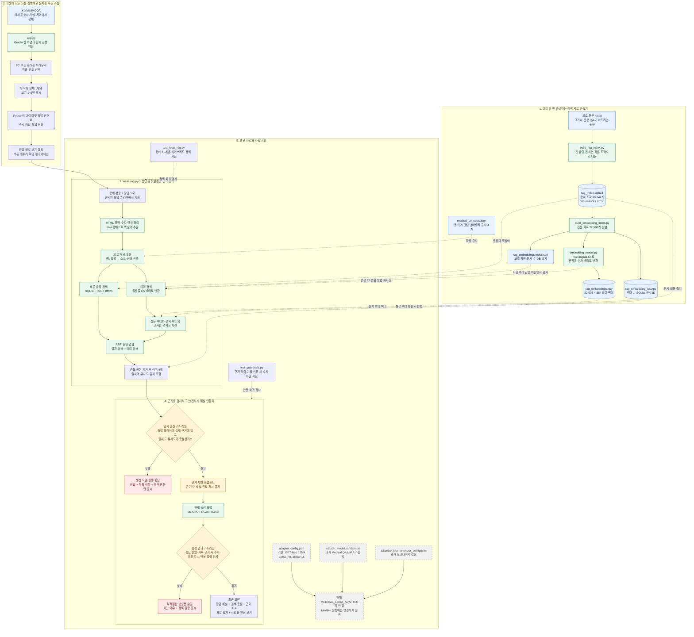

# 의료국가시험 RAG·Embedding 전체 흐름도

## 업데이트 003. 고등학생을 위한 파일 연결 지도

아래 한 장은 의료 원문이 검색 DB와 의미 벡터로 바뀌고, 학생이 해설 버튼을 눌렀을 때 정답 근거가 화면에 나오기까지의 전체 흐름입니다.

## 그림을 읽는 핵심 세 문장

1. **RAG**는 AI가 바로 추측하게 하지 않고, `rag_index.sqlite3`와 임베딩 파일에서 먼저 참고 자료를 찾는 과정입니다.
2. **Embedding**은 문장의 뜻을 384개의 숫자로 바꿔서 표현이 달라도 의미가 비슷한 문서를 찾는 기술입니다.
3. 검색 근거가 부족하거나 생성문이 근거 밖으로 벗어나면 **가드레일**이 해설을 차단하고 원문 근거만 보여 줍니다.

> 이 앱은 의료국가시험 학습용입니다. 실제 진단, 처방, 투약 또는 응급 판단에 사용하지 않습니다.
