# 의료국가시험 앱 실행 흐름도

이 문서는 `python app.py`를 실행했을 때 프로그램이 어떤 순서로 작동하는지 설명합니다. 흐름도는 Mermaid를 지원하는 Markdown 뷰어에서 볼 수 있습니다.

## 1. 전체 흐름 한눈에 보기

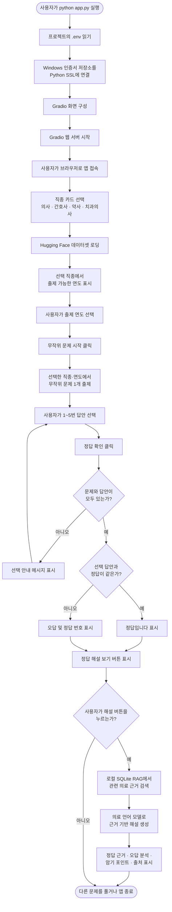

## 2. 프로그램 시작 단계

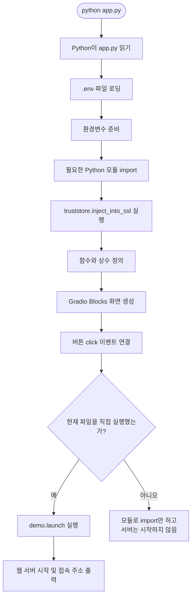

### 시작하면서 읽는 주요 환경변수

| 환경변수 | 역할 |
|---|---|
| `HF_TOKEN` | Hugging Face 데이터셋과 모델 접근 인증 |
| `KORMED_DATASET_ID` | 문제 데이터셋 지정 |
| `MEDICAL_BASE_MODEL` | 해설 생성 모델 지정 |
| `MEDICAL_LORA_ADAPTER` | 선택적인 LoRA 어댑터 경로 |
| `MEDICAL_TRUST_REMOTE_CODE` | 모델의 사용자 정의 코드 실행 허용 여부 |
| `MEDICAL_KNOWLEDGE_PATH` | 의료 지식 JSON 폴더 경로 |
| `RAG_INDEX_PATH` | SQLite RAG 인덱스 경로 |

중요한 점은 앱을 시작할 때 문제 데이터셋과 해설 모델을 모두 즉시 불러오지 않는다는 것입니다. 사용자가 기능을 처음 요청할 때 필요한 자료를 불러오는 **지연 로딩** 방식을 사용합니다.

## 3. 화면 구성과 상태 저장

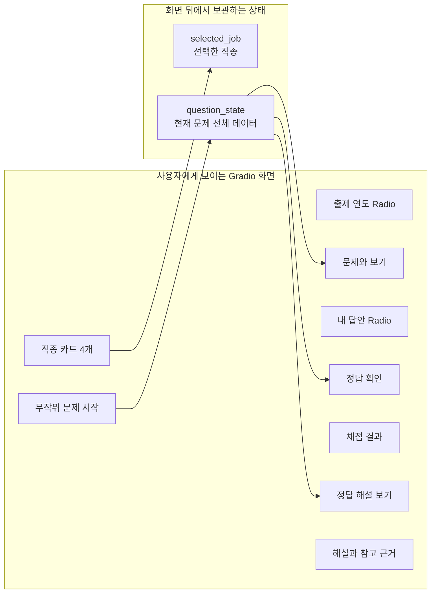

`selected_job`과 `question_state`는 화면에 직접 보이지 않는 `gr.State`입니다.

- `selected_job`: 사용자가 선택한 직종을 기억합니다.
- `question_state`: 현재 문제, 보기, 정답, 연도 등의 원본 데이터를 기억합니다.

## 4. 직종 및 연도 선택 과정

사용자가 직종 카드를 누르면 `select_job()`이 실행됩니다.

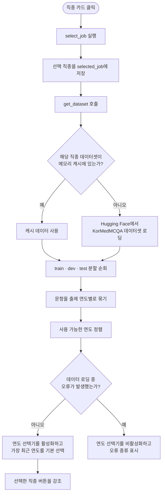

데이터셋은 직종별로 한 번 불러온 뒤 `lru_cache`에 저장합니다. 같은 직종을 다시 선택했을 때 네트워크에서 다시 내려받지 않고 메모리의 데이터를 재사용합니다.

직종 이름은 데이터셋 설정 이름으로 다음과 같이 변환됩니다.

| 화면의 직종 | 데이터셋 설정 이름 |
|---|---|
| 의사 | `doctor` |
| 간호사 | `nurse` |
| 약사 | `pharm` |
| 치과의사 | `dentist` |

## 5. 무작위 문제 출제 과정

사용자가 `무작위 문제 시작`을 누르면 `begin_quiz()`가 실행됩니다.

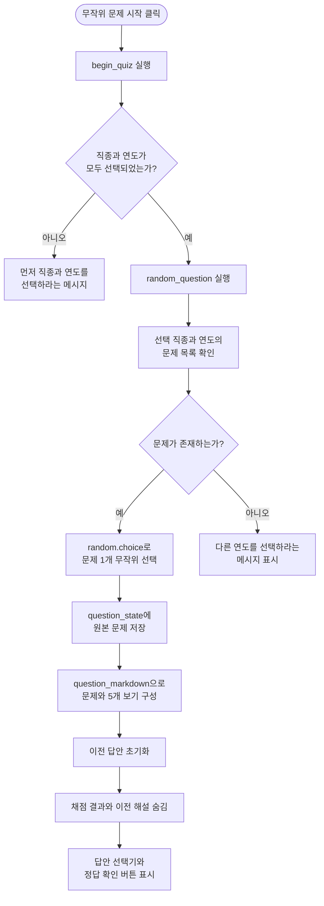

문제는 데이터셋의 `A`, `B`, `C`, `D`, `E` 보기를 화면의 1번부터 5번으로 변환해 표시합니다.

## 6. 정답 확인 과정

사용자가 `정답 확인`을 누르면 `grade_answer()`가 실행됩니다.

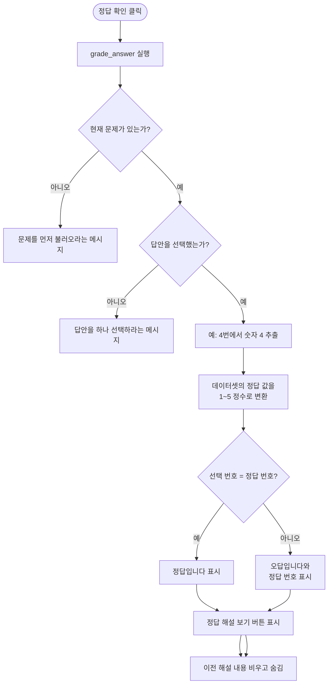

채점할 때는 해설 모델을 실행하지 않습니다. 따라서 모델 생성이 오래 걸려도 정답 번호는 즉시 표시됩니다. 무거운 AI 해설 생성은 사용자가 `정답 해설 보기`를 눌렀을 때만 별도로 실행됩니다.

## 7. 정답 해설 요청 과정

사용자가 `정답 해설 보기`를 누르면 `show_explanation()`을 거쳐 `make_explanation()`이 실행됩니다.

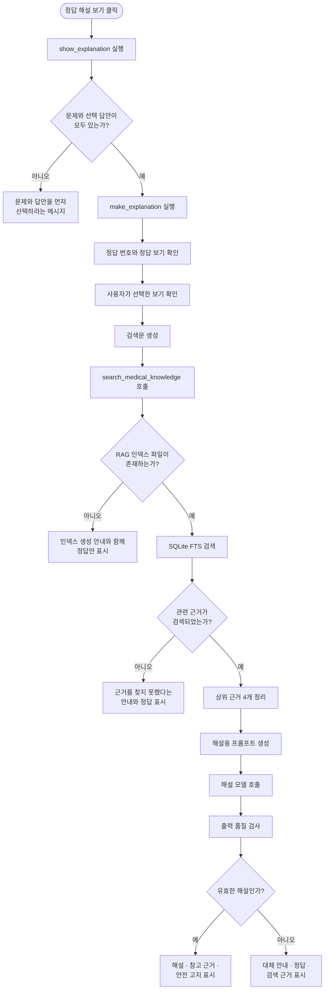

## 8. RAG 참고 근거 검색 과정

RAG는 Retrieval-Augmented Generation의 약자입니다. 먼저 자료를 검색한 뒤 그 자료를 모델에 전달해 답변을 생성하는 방식입니다.

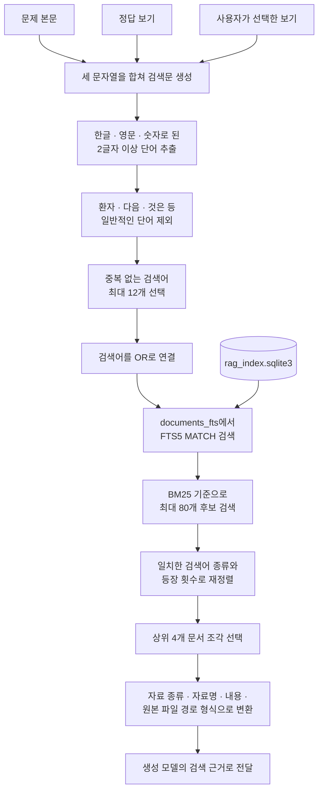

SQLite에는 다음 두 핵심 테이블이 있습니다.

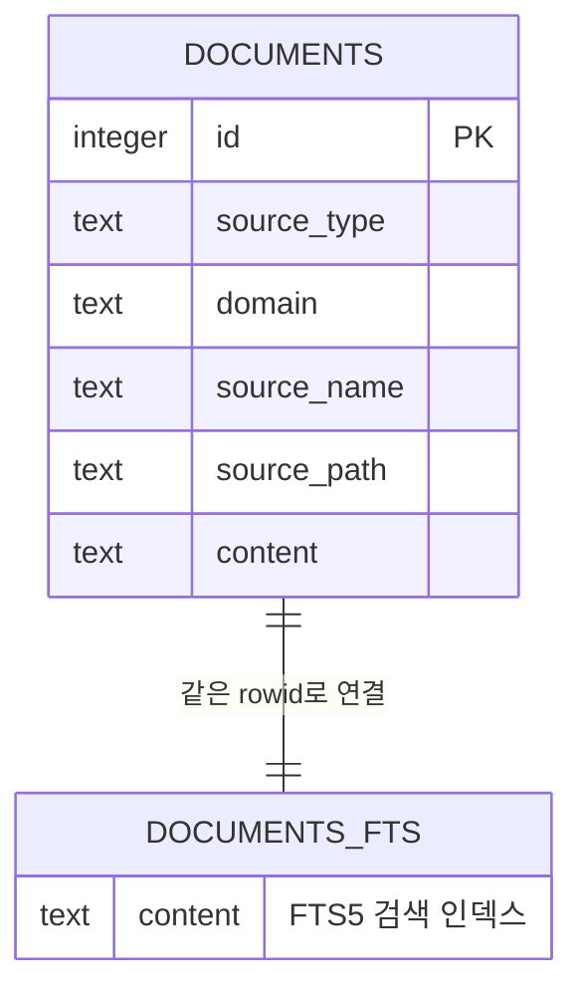

## 9. 해설 모델 로딩 및 생성 과정

해설 모델은 앱을 시작할 때가 아니라 처음 해설을 요청했을 때 `get_explainer()`에서 로딩됩니다.

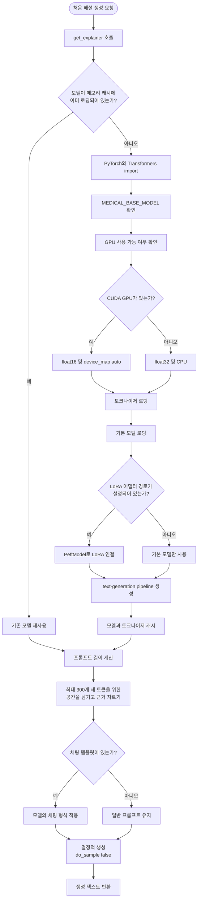

현재 `.env`에서는 다음 모델을 사용합니다.

```text
MediKo/MediKo-1.1B-A0.6B-inst
```

`MEDICAL_LORA_ADAPTER`는 비어 있으므로 현재 LoRA는 연결하지 않습니다.

## 10. 생성된 해설 품질 검사

소형 모델이 의미 없는 내용을 반복하거나 너무 짧은 결과를 만들 수 있으므로 `invalid_explanation()`이 출력 품질을 검사합니다.

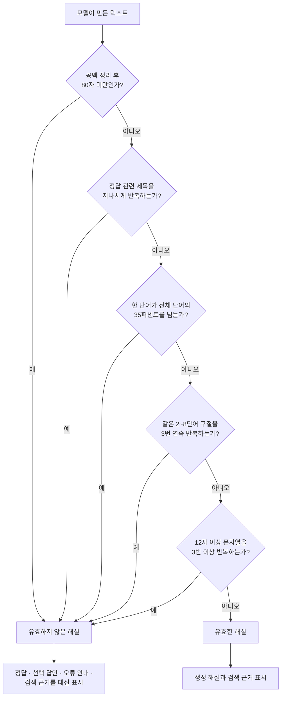

## 11. 오류가 발생해도 가능한 동작

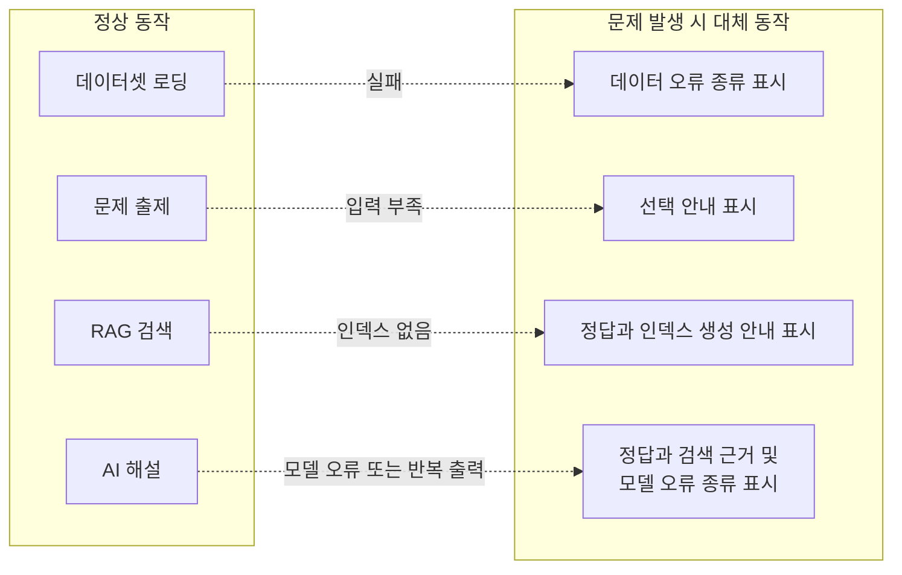

앱은 해설 생성이 실패하더라도 가능한 경우 정답 번호와 검색된 근거는 계속 보여주도록 설계되어 있습니다.

## 12. 주요 함수 호출 관계

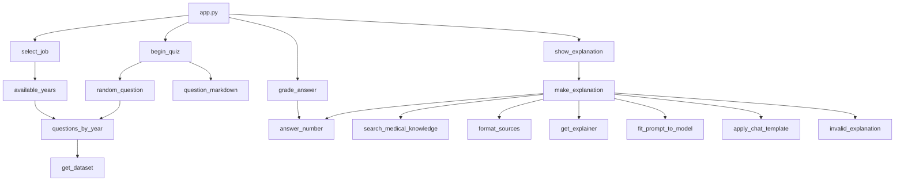

## 13. 파일별 역할

| 파일 또는 폴더 | 역할 |
|---|---|
| `app.py` | 화면 구성, 문제 출제, 채점, 해설 생성 전체 제어 |
| `local_rag.py` | 검색어 추출, SQLite FTS 검색, 참고 근거 형식화 |
| `build_rag_index.py` | 의료 JSON을 문서 조각으로 나누고 SQLite 인덱스 생성 |
| `.env` | 실제 모델, 토큰, 데이터 및 인덱스 경로 설정 |
| `.env.example` | 환경변수 작성 예시 |
| `medical_knowledge_data/` | 로컬 의료 전문지식 원본 JSON |
| `rag_index.sqlite3` | 검색 가능한 의료 문서 조각과 FTS5 인덱스 |
| `models/` | 선택적으로 사용할 로컬 모델 또는 LoRA 어댑터 |

## 14. 학생용 최종 요약

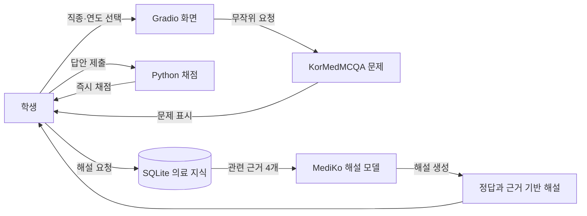

가장 중요한 흐름은 다음 한 줄로 정리할 수 있습니다.

> **학생이 문제를 선택하고 답을 제출하면 Python이 즉시 채점하고, 해설을 요청하면 SQLite가 관련 의료 근거를 찾은 뒤 MediKo 모델이 그 근거를 이용해 해설을 작성합니다.**

## 15. 같은 Wi-Fi에서 모바일 브라우저로 접속

15단계에서는 모델과 검색 DB를 로컬 PC에 그대로 두고, 같은 Wi-Fi에 연결된 스마트폰의 브라우저에서 화면만 사용합니다. 인터넷 외부 공개는 하지 않습니다.

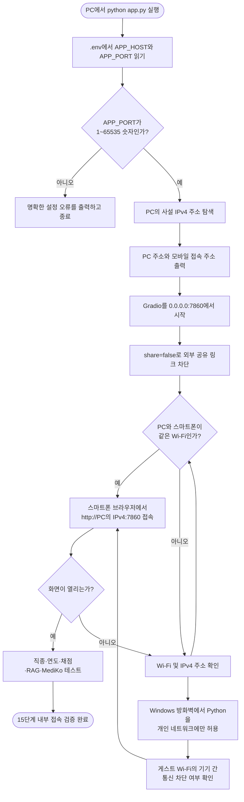

15단계의 실행 구성은 다음과 같습니다.

```text
모델 실행: 로컬 PC
검색 DB: 로컬 PC의 rag_index.sqlite3
화면: 같은 Wi-Fi의 모바일 브라우저
모델: MediKo/MediKo-1.1B-A0.6B-inst
접속: http://PC의 사설 IPv4 주소:7860
외부 공유: 비활성화
```

관련 코드 위치는 다음과 같습니다.

```text
app.py 46~61행       APP_HOST와 APP_PORT 읽기 및 검증
app.py 64~75행       PC의 사설 IPv4 주소 탐색
app.py 78~91행       모바일 접속 주소와 방화벽 안내 출력
app.py 471~480행     Gradio LAN 바인딩과 share=False 실행
.env 22~23행         현재 APP_HOST와 APP_PORT 설정
.env.example 21~22행 새 환경 구성용 LAN 설정 예시
```

실행 순서는 다음과 같습니다.

1. PC와 스마트폰을 같은 Wi-Fi에 연결합니다.
2. PC에서 `python app.py`를 실행합니다.
3. 터미널에 표시된 `http://사설-IP:7860` 주소를 확인합니다.
4. 스마트폰의 Chrome 또는 Safari 주소창에 해당 주소를 입력합니다.
5. 처음 나타나는 Windows 방화벽 안내에서는 Python을 **개인 네트워크**에만 허용합니다.
6. 문제 출제, 정답 확인, RAG 검색과 MediKo 해설을 차례로 시험합니다.

## 부록 A. 14단계별 파일명과 행 번호 범위

아래 행 번호는 현재 소스코드 기준입니다. 나중에 코드를 추가하거나 삭제하면 행 번호가 달라질 수 있으므로, 함수 이름도 함께 확인하는 것이 좋습니다.

| 단계 | 프로세스 | 파일 및 행 번호 | 핵심 함수·코드 |
|---:|---|---|---|
| 1 | 전체 흐름 | `app.py` 1~480행, `local_rag.py` 1~115행 | 앱 초기화부터 화면, 채점, RAG, 해설까지 전체 흐름 |
| 2 | 프로그램 시작 | `app.py` 1~92행, 416~480행 | 모듈 import, `.env`, SSL, LAN 설정, Gradio UI 및 `demo.launch()` |
| 3 | 화면 구성과 상태 저장 | `app.py` 416~439행 | `gr.Blocks`, `gr.State`, 직종·연도·문제·답안·해설 UI |
| 4 | 직종 및 연도 선택 | `app.py` 95~118행, 319~339행, 442~446행 | `get_dataset()`, `questions_by_year()`, `available_years()`, `select_job()` |
| 5 | 무작위 문제 출제 | `app.py` 121~133행, 342~372행, 448~451행 | `random_question()`, `question_markdown()`, `begin_quiz()` |
| 6 | 정답 확인 | `app.py` 136~138행, 375~407행, 453~456행 | `answer_number()`, `grade_answer()`, 제출 버튼 이벤트 |
| 7 | 정답 해설 요청 | `app.py` 235~316행, 410~413행, 458행 | `make_explanation()`, `show_explanation()`, 해설 버튼 이벤트 |
| 8 | RAG 참고 근거 검색 | `app.py` 239~257행, `local_rag.py` 23~115행 | 검색문 생성, `query_terms()`, `search_medical_knowledge()`, `format_sources()` |
| 9 | 해설 모델 로딩 및 생성 | `app.py` 142~205행, 275~294행 | `get_explainer()`, 프롬프트 길이 조절, 채팅 템플릿, 모델 생성 |
| 10 | 생성 해설 품질 검사 | `app.py` 208~232행, 295~316행 | `invalid_explanation()` 및 실패 시 대체 출력 |
| 11 | 오류 발생 시 대체 처리 | `app.py` 252~274행, 297~316행, 319~372행, 375~413행 | RAG·모델·데이터·사용자 입력 오류 처리 |
| 12 | 주요 함수 호출 관계 | `app.py` 95~413행, 442~458행, `local_rag.py` 23~115행 | 데이터셋, 문제, 채점, 검색, 모델 함수와 이벤트 연결 |
| 13 | 파일별 역할 | `app.py` 1~480행, `local_rag.py` 1~115행, `build_rag_index.py` 1~106행 | 실행 앱, RAG 검색, 인덱스 생성의 역할 분리 |
| 14 | 학생용 최종 요약 | `app.py` 319~413행, 416~458행, `local_rag.py` 31~115행 | 사용자 조작부터 문제 출제·채점·근거 검색·해설까지 핵심 경로 |

### 1단계: 전체 흐름

전체 흐름은 한 함수에 모두 들어 있지 않고 세 파일에 나누어져 있습니다.

```text
app.py                 1~480행   앱 실행 및 전체 기능 제어
local_rag.py           1~115행   의료 참고 근거 검색
build_rag_index.py     1~106행   검색 DB를 미리 만드는 별도 작업
```

`build_rag_index.py`는 `python app.py`를 실행할 때마다 호출되는 파일은 아닙니다. 의료 JSON이 추가되거나 변경됐을 때 사용자가 별도로 실행합니다.

### 2단계: 프로그램 시작

```text
app.py 1~17행       파일 설명과 기본 모듈 import
app.py 18~21행      python-dotenv import 및 .env 로딩
app.py 23~29행      Gradio, truststore, datasets, RAG 함수 import
app.py 26행         Windows 인증서 저장소를 SSL에 연결
app.py 32~43행      직종, 보기, 데이터셋, 토큰, 안전 고지 상수
app.py 46~91행      LAN 서버 설정, 주소 탐색 및 접속 안내
app.py 416~469행    Gradio 화면과 이벤트 구성
app.py 471~480행    직접 실행 여부 확인 후 LAN 웹 서버 시작
```

### 3단계: 화면 구성과 상태 저장

```text
app.py 416행        Gradio Blocks 시작
app.py 417~418행    제목과 의료 안전 고지
app.py 420~421행    question_state와 selected_job 생성
app.py 423~434행    직종 카드, 연도, 시작 버튼
app.py 436~439행    문제, 답안, 채점 결과, 해설 UI
```

### 4단계: 직종 및 연도 선택

```text
app.py 95~97행      get_dataset(): 직종 데이터셋 지연 로딩 및 캐시
app.py 100~102행    row_year(): 연도 값을 문자열로 정규화
app.py 106~114행    questions_by_year(): 세 분할을 연도별로 묶기
app.py 117~118행    available_years(): 사용 가능한 연도 정렬
app.py 319~339행    select_job(): 연도 선택기 및 카드 상태 변경
app.py 442~446행    직종 버튼과 select_job 이벤트 연결
```

### 5단계: 무작위 문제 출제

```text
app.py 121~126행    random_question(): 후보 중 문제 하나 선택
app.py 129~133행    question_markdown(): 문제와 보기 표시 형식 생성
app.py 342~372행    begin_quiz(): 입력 확인, 상태 초기화 및 문제 표시
app.py 448~451행    시작 버튼과 begin_quiz 이벤트 연결
```

### 6단계: 정답 확인

```text
app.py 136~138행    answer_number(): 정답을 1~5 정수로 변환
app.py 375~407행    grade_answer(): 입력 검사 및 정답·오답 판정
app.py 453~456행    정답 확인 버튼과 grade_answer 이벤트 연결
```

### 7단계: 정답 해설 요청

```text
app.py 235~316행    make_explanation(): 검색부터 해설 결과 구성
app.py 410~413행    show_explanation(): 문제와 답안 확인 후 해설 요청
app.py 458행        해설 버튼과 show_explanation 이벤트 연결
```

### 8단계: RAG 참고 근거 검색

```text
app.py 239~243행           문제·정답·선택 보기를 검색문으로 결합
app.py 244~257행           RAG 예외, 검색 결과 없음, 근거 형식화 처리
local_rag.py 23~28행       의료 자료와 SQLite 인덱스 경로 결정
local_rag.py 31~42행       query_terms(): 검색어 최대 12개 추출
local_rag.py 45~47행       긴 결과를 600자로 줄이기
local_rag.py 50~101행      SQLite FTS 검색과 후보 재정렬
local_rag.py 104~115행     검색 결과를 모델용 근거 형식으로 변환
```

RAG 데이터베이스를 만드는 코드는 다음 위치에 있습니다.

```text
build_rag_index.py 13~25행    파일 종류와 본문 추출
build_rag_index.py 28~44행    문서를 1,100자 조각으로 분리
build_rag_index.py 47~102행   SQLite 테이블 생성과 데이터 삽입
```

### 9단계: 해설 모델 로딩 및 생성

```text
app.py 142~173행    get_explainer(): 토크나이저·모델·LoRA 로딩
app.py 176~193행    fit_prompt_to_model(): 컨텍스트 길이에 맞게 근거 조절
app.py 196~205행    apply_chat_template(): 모델의 대화 형식 적용
app.py 275~294행    생성 설정 구성 및 최대 300토큰 해설 생성
```

### 10단계: 생성 해설 품질 검사

```text
app.py 208~232행    invalid_explanation(): 길이와 반복 패턴 검사
app.py 295~298행    유효하지 않은 출력을 오류 처리로 전환
app.py 299~316행    모델 오류 시 정답과 검색 근거를 대신 표시
```

### 11단계: 오류 발생 시 대체 처리

```text
app.py 244~257행    RAG 인덱스 없음 또는 검색 결과 없음
app.py 297~316행    모델 로딩·생성·품질 오류
app.py 326~339행    데이터셋 로딩 오류
app.py 343~364행    직종·연도 누락 또는 해당 연도 문항 없음
app.py 376~389행    문제 또는 답안 누락
app.py 411~413행    해설 요청 시 문제 또는 답안 누락
```

### 12단계: 주요 함수 호출 관계

```text
app.py 95~413행          핵심 문제·채점·해설 함수 정의
app.py 442~458행         화면 버튼과 핵심 함수 연결
local_rag.py 23~115행    app.py에서 호출하는 RAG 함수
```

이 단계의 Mermaid 화살표는 실제 함수 호출 관계를 나타냅니다. 예를 들어 `show_explanation()`은 `make_explanation()`을 호출하고, `make_explanation()`은 다시 `search_medical_knowledge()`와 `get_explainer()`를 호출합니다.

### 13단계: 파일별 역할

```text
app.py                 1~480행   메인 애플리케이션
local_rag.py           1~115행   실행 중 RAG 검색
build_rag_index.py     1~106행   실행 전 RAG 인덱스 구축
.env                   전체      실제 환경변수 값
.env.example           전체      환경변수 작성 예시
rag_index.sqlite3      바이너리   검색 DB이므로 텍스트 행 번호 없음
medical_knowledge_data JSON 파일  RAG 원문 자료
```

### 14단계: 학생용 최종 요약

```text
app.py 319~339행       직종 선택
app.py 342~372행       문제 출제
app.py 375~407행       즉시 채점
app.py 410~413행       해설 요청 접수
app.py 235~316행       RAG와 모델을 이용한 해설 작성
local_rag.py 31~115행  검색어 추출과 의료 근거 선택
app.py 416~458행       위 기능을 화면 버튼에 연결
```

### 코드 위치를 직접 찾는 방법

행 번호가 변경된 경우 PowerShell에서 다음 명령으로 함수 위치를 다시 찾을 수 있습니다.

```powershell
rg -n "^def |^with gr.Blocks|\.click\(" app.py local_rag.py build_rag_index.py
```

VS Code에서는 `Ctrl+P`를 누른 뒤 다음과 같이 입력하면 지정한 행으로 바로 이동할 수 있습니다.

```text
app.py:326
local_rag.py:50
build_rag_index.py:47
```

## 업데이트 001. 하이브리드 RAG·가드레일·노트북 이전 흐름 추가

> 이 업데이트는 위 7~10단계에 남아 있는 초기 FTS 전용 설명을 현재 코드에 맞게 보완합니다. 현재 검색문에는 사용자가 선택한 오답을 넣지 않고 **문제 본문과 정답 보기**만 사용합니다.

### 현재 정답 해설 버튼 처리

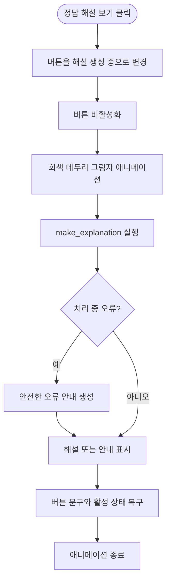

`show_explanation()`은 Python 생성기로 첫 번째 화면 갱신을 먼저 보내므로 별도의 사용자 JavaScript 없이 로딩 상태를 표시합니다. `trigger_mode="once"`와 버튼 비활성화로 중복 요청을 막습니다.

### 현재 하이브리드 근거 검색

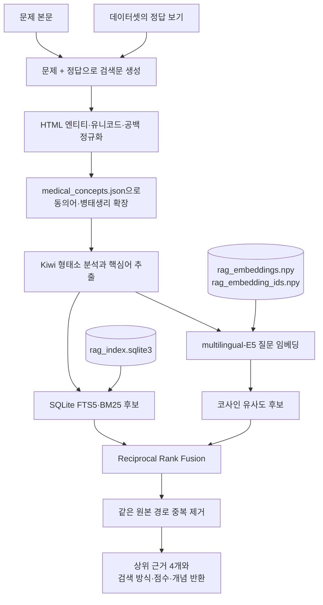

### 3단계 해설 가드레일

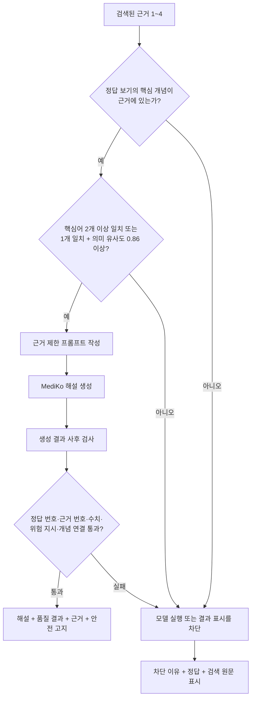

### 노트북 이전과 외부 휴대폰 테스트

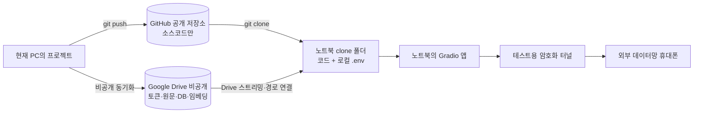

자세한 명령은 `노트북으로이사.md`의 `업데이트 001`을 따릅니다. 임시 외부 URL은 공개하지 않으며 실제 환자 정보를 입력하지 않습니다.

### 업데이트 001의 현재 코드 위치

| 기능 | 파일 및 현재 행 |
|---|---|
| 검색 정규화·개념 확장·형태소 분석 | `local_rag.py` 67~162행 |
| SQLite FTS 후보 검색 | `local_rag.py` 168~203행 |
| 임베딩 모델과 벡터 인덱스 | `local_rag.py` 205~281행, `embedding_model.py` 14~48행 |
| 하이브리드 결합과 근거 형식화 | `local_rag.py` 288~383행 |
| 검색 품질 가드레일 | `app.py` 245~287행 |
| 생성 결과 가드레일 | `app.py` 301~341행 |
| 문제+정답 검색 및 해설 생성 | `app.py` 344~461행 |
| 버튼 로딩 생성기 | `app.py` 555~577행 |
| Gradio 화면·이벤트·CSS | `app.py` 584~678행 |

### 문서 기록 규칙

앞으로 코드가 업데이트되면 같은 일련번호와 제목으로 다음 문서를 함께 갱신합니다.

1. `설명가능한ai.md`
2. `에러해결파워쉘명렁어.md`
3. `플로우챠트.md`
4. `환경변수.md`
5. `sqllite사용설명서.md`

## 업데이트 002. 실제 사용 환경변수만 유지

`.env.example`의 환경설정 흐름을 현재 프로젝트 구성과 일치시켰습니다.

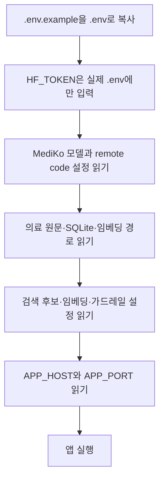

삭제된 `OPENAI_API_KEY`와 프록시 예시는 현재 앱 코드의 실행 흐름에 포함되지 않았으므로 플로우차트 영향이 없습니다. 검색·생성 함수와 화면 이벤트에도 코드 변경은 없습니다.
